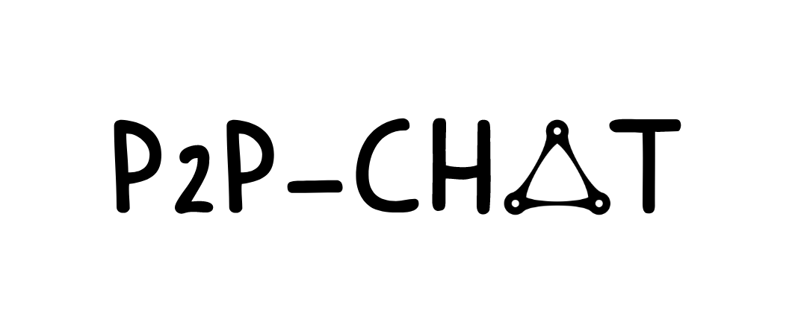

 
 

 
 

## About p2p-chat

[![Telegram Group][telegram-badge]][telegram-url]

[telegram-badge]: https://cdn.jsdelivr.net/gh/Patrolavia/telegram-badge@8fe3382b3fd3a1c533ba270e608035a27e430c2e/chat.svg
[telegram-url]: https://t.me/+SiZ53KtzsMw0M2Rl

一个基于rust-p2p的点对点的聊天协议。（这是一个实验性的项目）

## 目标

1. 实现简单的点对点聊天
2. 实现一些图片发送的功能
3. 实现文件发送功能
4. 提供一些公共的节点服务（openAI，帮助他人存储聊天信息，这将在issue详细讨论）
5. 提供群功能，群的消息可能很多，群消息不应该存储

## 特点

- 无信令服务器，纯点对点
- 可部署公共服务器给他人使用
- 对接bfchain，为提供服务的节点提供收益

## 多地址

+ 当p2p 网络上的节点共享其联系信息时，它们会发送一个包含网
络地址和 peer id 的多地址( multiaddress)。

+ 节点多地址的 peer id 表示奶下：
0/p2p/12D3KooWBu3fmjZgSMLk@2pIDG35UmEayYBrhsk6WEeIxcolJFbV

+ 多地址的网络地址表示如下：
0/ip4/192.158.1.23/tcp/1234

+ 节点的完整多地址就是 peer id 和网络地址的组合：
o/ip4/192.158.1.23/tcp/1234/p2p/12D3KooWBu3fmjZgSMLkQ2pIDG35UmEay
YBrhsk6WEelxcol]FbV
