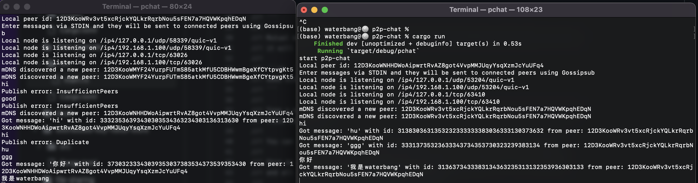

 
 

 
 

## About p2p-chat

[![Telegram Group][telegram-badge]][telegram-url]

[telegram-badge]: https://cdn.jsdelivr.net/gh/Patrolavia/telegram-badge@8fe3382b3fd3a1c533ba270e608035a27e430c2e/chat.svg
[telegram-url]: https://t.me/+SiZ53KtzsMw0M2Rl

一个基于rust-p2p的点对点的聊天应用。（这是一个实验性的项目）（什么时候能自己实现协议(小声bb)

> 如果您有建设性的意见，请在issues讨论。

## 目标

1. 实现简单的点对点聊天
2. 实现一些图片发送的功能
3. 实现文件发送功能
4. 提供一些公共的节点服务（openAI，帮助他人存储聊天信息，这将在issue详细讨论）
5. 提供群功能，群的消息可能很多，群消息不应该存储

## 特点

- 可部署公共服务器给他人使用,如自然语言节点,存储节点，群聊节点，中继节点。
- 本地的聊天数据可以配置存储节点提供存储功能，并且可以向其他节点提供存储服务，以[bfm](https://tracker.bfmeta.org/#/)（bfm为bfmeta交易货币）结算。
- 对接[bfmeta](https://www.bfmeta.org/)，为提供服务的节点提供收益

## 协议栈

[p2p-chat protocol](./core/protocol/README.md)

## 随笔

当前进行到第一步，也就是实现一个点对点的聊天，目前想直接通过mdns进行发现节点,使用quic(基于UDP)连接传输信息，然后收发简单的文本信息。

(基本的libp2p的chat示例)
 

 

忘记实现私聊了尴尬，在实现私聊时，需要确保消息的机密性和完整性。
使用加密算法和数字签名来保护消息的机密性和完整性，以防止消息被第三方窃取或篡改，是当前主要目标。

接下来将提供发送图片消息，和一些节点信息的维护，比如：发现局域网的新节点，跟踪已知节点。

### 关于中继节点

在ipv6完全普及的年代，每个设备一个地址还是不太现实，因此还是得有中继节点的概念，更多时候他应该充当一个网关。
这个节点应该可以配置一些白名单和一些路由策略。暂时还没想好( ̀⌄ ́)

### 关于存储节点

由于是去中心化的网络，数据的存储是一大难题，因此引出存储节点的功能，存储节点可用户自己部署，也可以使用其他用户部署的付费存储节点。
当用户在部署付费节点的时候，需要使用[bfmt](https://tracker.bfmeta.org/#/)向权益管理地址进行质押，保障存储节点稳定性。

### 关于ai节点

当前ai技术的爆发，把每个人的独立协作给了很大的推进力，特别是以后chat-GPT4,法律顾问的对话模型等的出现，这种需求将会大大增加。
而开放ai节点，能更多的让个体部署部署服务，通过贩卖一些闲置的资源，赚取一些费用。

## libp2p协议

### ping `/ipfs/ping/1.0.0`

活性检测，快速查看另一个点是否在线。

### 识别协议 `/ipfs/id/1.0.0`

协议允许对等方交换关于彼此的信息，比如他们的公钥和已知网络地址。

### 推送更新 `/ipfs/id/push/1.0.0`

如果对等点开始侦听新地址、建立新的中继电路或使用标准 identify 协议从其他对等点了解其公共地址。
在创建或学习新地址后，对等点可以将新地址推送给它当前知道的所有对等点。

### 中继 `/libp2p/circuit/relay/0.1.0`

用于在两个对等点无法直接相互连接时通过中继对等点传输流量。

## 多地址

+ 当p2p 网络上的节点共享其联系信息时，它们会发送一个包含网
络地址和 peer id 的多地址( multiaddress)。

+ 节点多地址的 peer id 表示奶下：
0/p2p/12D3KooWBu3fmjZgSMLk@2pIDG35UmEayYBrhsk6WEeIxcolJFbV

+ 多地址的网络地址表示如下：
0/ip4/192.158.1.23/tcp/1234

+ 节点的完整多地址就是 peer id 和网络地址的组合：
o/ip4/192.158.1.23/tcp/1234/p2p/12D3KooWBu3fmjZgSMLkQ2pIDG35UmEay
YBrhsk6WEelxcolFbV
